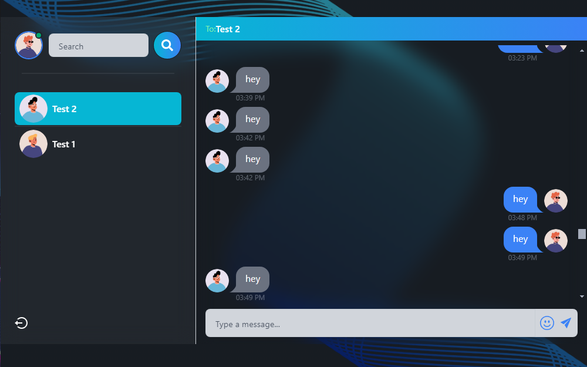
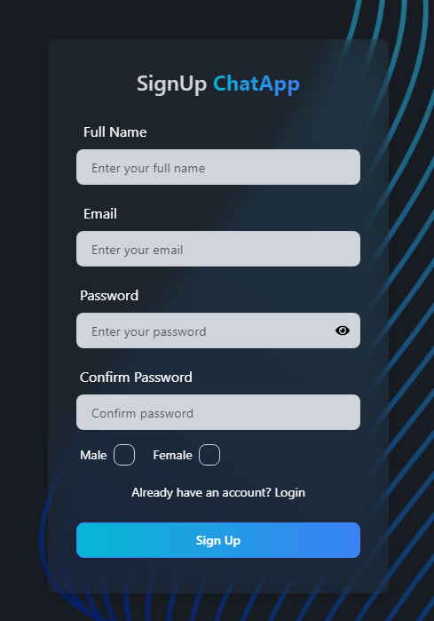
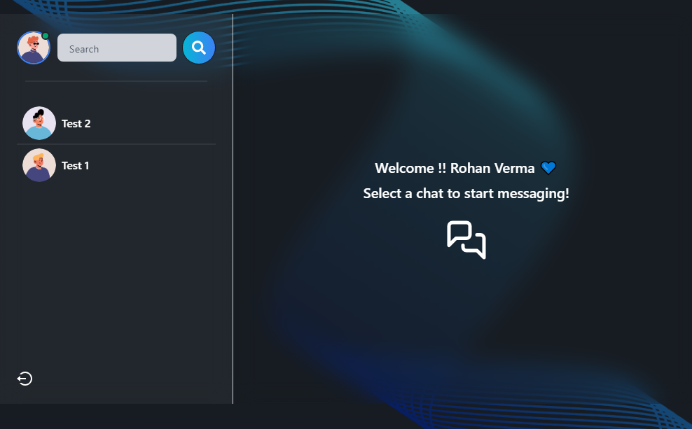

# ChatApp

ChatApp is a real-time messaging application built on modern web technology. It provides a seamless and secure communication experience with features such as user authentication, email verification, password recovery, and real-time chat functionality

<p align="center">
  
</p>

## Features:

* User Authentication (Signup, Login, Logout)
* Email Verification
* Forget Password Functionality
* Real-time Messaging
* Online User Status

## Tech Stack:

* **Frontend:** React.js
* **Backend:** Node.js with Express.js
* **Database:** MongoDB
* **Real-time Communication:** Socket.io
* **Styling:** Tailwind CSS
* **Email Service:** SendinBlue (Brevo)

<p align="center">
  &nbsp;&nbsp;&nbsp;&nbsp;&nbsp;&nbsp;

  
</p>

## Key Components

* **User Authentication:** User authentication is implemented using JWT (JSON Web Tokens) for secure user identification and authorization.

* **Email Verification:** Email verification is implemented using SendinBlue's API for email verification.

* **Password Recovery:** Password recovery functionality is implemented using SendinBlue's API for password reset.

* **Real-time Messaging:** Real-time messaging is implemented using Socket.io for bi-directional communication between the client and server.

* **Cleanup Task for Unverified Users:** Yhe app includes a task that deletes unverified users after 15 minutes using cron. To keep the database clean and avoid issues with re-registration, This ensures that unverified accounts are removed, making the email available for reuse without showing errors to users trying to register again.

```javascript
import cron from 'node-cron';
import User from '../models/user.model.js';

const cleanupUnverifiedUsers = async () => {
  const fifteenMinutesAgo = new Date(Date.now() - 15 * 60 * 1000);
  const result = await User.deleteMany({
    isVerified: false,
    createdAt: { $lt: fifteenMinutesAgo }
  });
  console.log(`Cleaned up ${result.deletedCount} unverified users`);
};

export const startCleanupTask = () => {
  cron.schedule('*/15 * * * *', cleanupUnverifiedUsers);
};

```
<p align="center">
  
</p>

## Installation and Setup

1. Clone the repository
2. Install dependencies for both frontend and backend
3. Set up environment variables (MongoDB URI, JWT secret, email service credentials)
4. Run the backend server: `npm run server`
5. Run the frontend development server: `npm run dev`

## Contributing

Pull requests are welcome. For major changes, please open an issue first to discuss what you would like to change.

## License 

This project is licensed under the MIT License. See the LICENSE file for more details.

Check Out the <a href="https://rohanvron.github.io/CardMaker/"> DEMO </a>